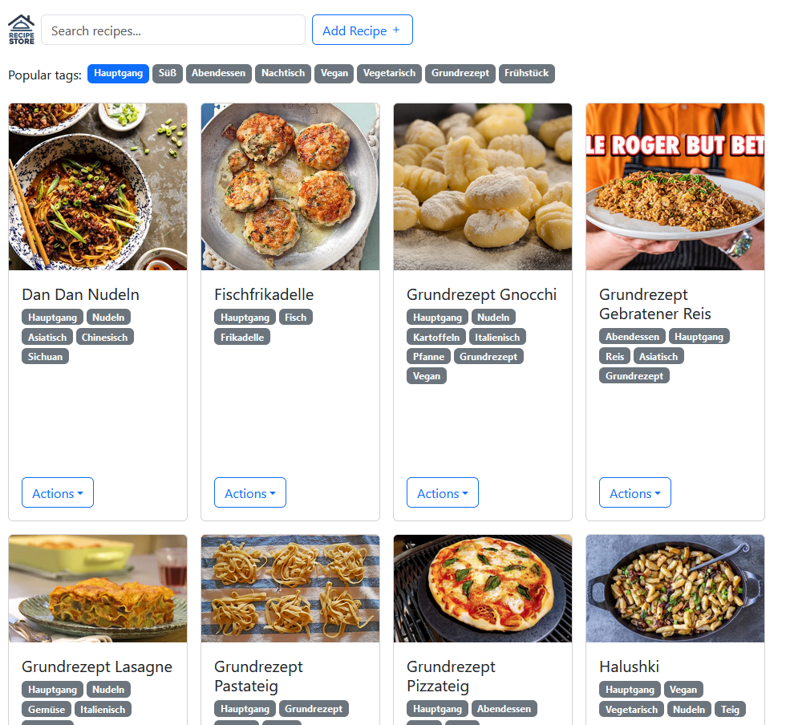

# recipe-store

Use a github repository to store and search recipes.

## Features

* Search recipes by name and tags
* Add new recipes
* Edit and delete recipes

## How it looks

## How it works
A static site built using react is hosted using github pages. It access the recipes stored in the repository. Recipes contain metadata (name and tags), a pdf file with the recipe itself and optionally a thumbnail image. These files are stored the `recipes` folder, each folder named after the initial recipe name.

### Security and access

A personal access token with read and write permissions to the repository is required and is prompted when opening the github page. It is stored as a cookie for up to 6 months so that the user only needs to enter it once. Note that this is not particularily secure and anyone with that token can modfiy and delete all files in the repository. Read more about personal access tokens [here](https://docs.github.com/en/authentication/keeping-your-account-and-data-secure/managing-your-personal-access-tokens).